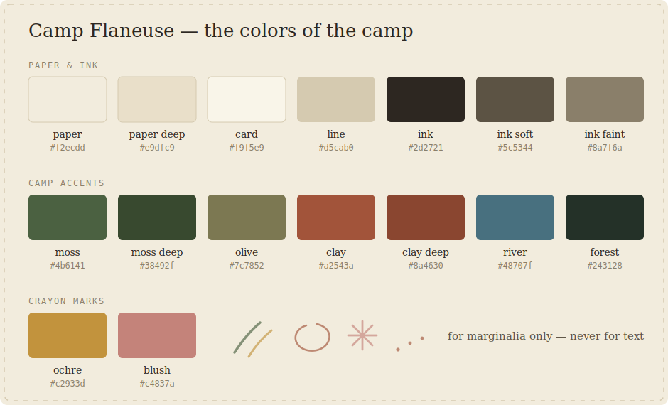
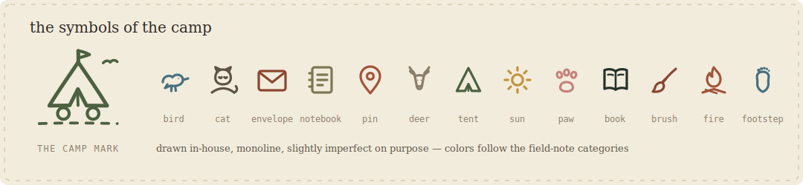

# Camp Flaneuse

A moving camp for field notes, letters, soft rebellion, and wonder.

This is the MVP website for **Camp Flaneuse** — part travel journal, part artist archive, part correspondence project, part tiny online camp. Built with [Astro](https://astro.build), TypeScript, and Markdown. Static, fast, no backend, no CMS — the first cabin, not the whole village.

## Content rooms

Camp Flaneuse is organized into a few small rooms:

- **Field Notes** — observations from the road: places, weather, birds, museums, books, studio process, and strange parking lots. *Things you notice.*
- **The Road Atlas** — real geography: motorhome stops, museums, walks, and towns, pinned on a map. *Where things happened.*
- **Campfire Stories** — myths, ghost stories, fables, fragments, and road folklore. *Things that did not happen exactly, but may still be true.*
- **The Soft Footsteps Society** — the letters room: the Correspondence Desk, letters from the road, and a future correspondence/art project for attentive walkers. *Things you send.* (A letter can carry a story as an `enclosure` — the Society sends the letter, the fire keeps the story.)
- **Flaneuse Studio** — small websites with soul for artists, writers, makers, and other sincere people. *Things you make for others.*

## Commands

| Command            | What it does                                            |
| ------------------ | ------------------------------------------------------- |
| `npm install`      | Install dependencies                                    |
| `npm run dev`      | Start the dev server at `http://localhost:4321`         |
| `npm run build`    | Build the static site into `dist/`                      |
| `npm run preview`  | Preview the built site locally                          |
| `npm run check`    | Type-check all pages and components                     |
| `npm run validate` | Check + build — "is the camp structurally safe?" button |

> Requires Node 22.12.0 or newer (Astro 7's minimum). The project standard is **Node 24.18.0**, pinned in `.nvmrc` — with nvm-windows run `nvm use 24.18.0`. Cloudflare's build machines read `.nvmrc` too, so local and production use the same version.

## How to add a field note

Create a Markdown file in `src/content/field-notes/en/` (or `pt/` for Portuguese). The file name becomes the URL slug.

```yaml
---
title: "Road Note: Something You Noticed"
date: "2026-07-15"
location: "Wherever you were"
category: "road"          # road | creature | studio | camp | weather | reading | art
excerpt: "One or two sentences that appear on the card."
tags: ["road life", "example"]
language: "en"            # en | pt — must match the folder
translationKey: "my-note" # optional — connects EN and PT versions of the same note
draft: false              # true hides it from the site
---

The note itself, in Markdown. Paragraphs, lists, *emphasis*, headings — all work.
```

That's it. The archive page, homepage cards, prev/next navigation, and metadata all update automatically on the next build.

**Photos** live in `src/content/field-notes/photos/`. Reference them from a note as `../photos/name.jpg` — in the body as a normal Markdown image, and/or as `coverImage: "../photos/name.jpg"` in the frontmatter to put a little photo stamp on the note's card. Astro resizes and optimizes them at build time. 

## How to add a letter (the Soft Footsteps Society)

Same idea, in `src/content/correspondence/en/` or `pt/` (the folder keeps its name; the pages publish under `/soft-footsteps-society/<slug>`):

```yaml
---
number: "002"
title: "Correspondence No. 002"
subtitle: "A short subtitle"
date: "2026-08-01"
location: "Somewhere"
excerpt: "The line shown on the envelope card."
language: "en"
translationKey: "correspondence-002"
drawingPlaceholder: true   # shows the dashed "drawing lives here" box
draft: false
---

Dear reader, ...
```

## Languages

- English is the default (`/`, `/about`, `/field-notes`, …).
- Portuguese lives under `/pt/` (`/pt/sobre`, `/pt/notas-de-campo`, …).
- The language switcher in the header links to the matching translated page when one exists (via `translationKey`), otherwise to the other language's homepage.
- Not every post needs a translation. Untranslated posts simply don't appear in the other language's archive — nothing breaks.
- All shared UI strings live in `src/lib/i18n.ts`. Page copy lives in the pages themselves.

## Where things live

```
src/
  content/            ← all posts, stories, and letters (Markdown) — edit here most often
    field-notes/{en,pt,photos}/
    stories/{en,pt}/
    correspondence/{en,pt}/
  content.config.ts   ← content schemas (frontmatter validation)
  pages/              ← one file per page; pt/ mirrors the English pages
  components/
    layout/           ← BaseLayout, Header, Footer
    content/          ← FieldNoteCard, LetterCard, MetadataLine, TagList, ImagePlaceholder
    sections/         ← Hero, SectionIntro, ExploreCard, CTASection, StudioPackageCard, PageTitle
    decor/            ← the handmade layer: LogoMark, Icon, DecorativeMarks, WelcomeGate
  lib/
    i18n.ts           ← languages, routes, UI strings, category labels
    content.ts        ← content collection helpers
  styles/
    tokens.css        ← the design system: colors, fonts, spacing (change the look here)
    global.css        ← base styles, prose, buttons, labels
wrangler.jsonc        ← Cloudflare Workers config (static assets, 404 handling)
```

## Design system

All colors, fonts, and spacing are CSS variables in `src/styles/tokens.css` — change them once, the whole site follows. Palette: warm paper, deep ink, moss, faded olive, dusty clay, river blue, dark forest — plus crayon mark colors (ochre, blush) for marginalia. Fonts: Fraunces (headings), Karla (body), IBM Plex Mono (field labels), Caveat (handwritten accents only) — all self-hosted via Fontsource, no external requests.

The handmade layer lives in `src/components/decor/`:

- **LogoMark** — the tent-on-wheels camp sign; scales from header to welcome screen
- **Icon** — monoline camp glyphs (bird, cat, envelope, notebook, pin, deer, tent, sun, paw)
- **DecorativeMarks** — colored-pencil marks at the page edges; desktop-first, reduced to almost nothing on phones; `--mark-opacity` in tokens.css controls how loud they are
- **WelcomeGate** — the once-per-session arrival screen; hidden without JavaScript, skippable by click or key, respects reduced motion, never blocks SEO

Everything decorative is `aria-hidden` and sits behind the content — remove any of these components from `BaseLayout.astro` and the site works fine without them.

### The colors of the camp



### The symbols of the camp



## Deploying

The site is **live** at <https://campflaneuse.com> (also reachable at <https://camp-flaneuse.eliseflaneuse.workers.dev>), hosted on Cloudflare Workers (static assets only — see `wrangler.jsonc`). Every push to `main` triggers an automatic build and deploy via Cloudflare Workers Builds; it's live about 90 seconds after `git push`. Run `npm run validate` before pushing when you've touched components or config.

## Remaining placeholders

- [ ] Real Open Graph image (currently `public/og-placeholder.svg`)
- [ ] Drawings for the `ImagePlaceholder` boxes, whenever the deer agrees to be drawn

## Later (deliberately not built yet)

- [ ] **Camp map's return** — the hand-drawn clickable map (`src/components/sections/CampMap.astro`) is currently unmounted from both homepages; bring it back when it earns its place.
- [ ] **Real contact email** — the contact pages show a charming closed mailbox until the domain (and a real address) exist.

Also: newsletter, snail-mail subscriptions, shop, member area, full bilingual parity, Obsidian workflow. The structure leaves room for all of it — content collections can grow, routes are language-aware, and nothing here needs to be torn down first.
