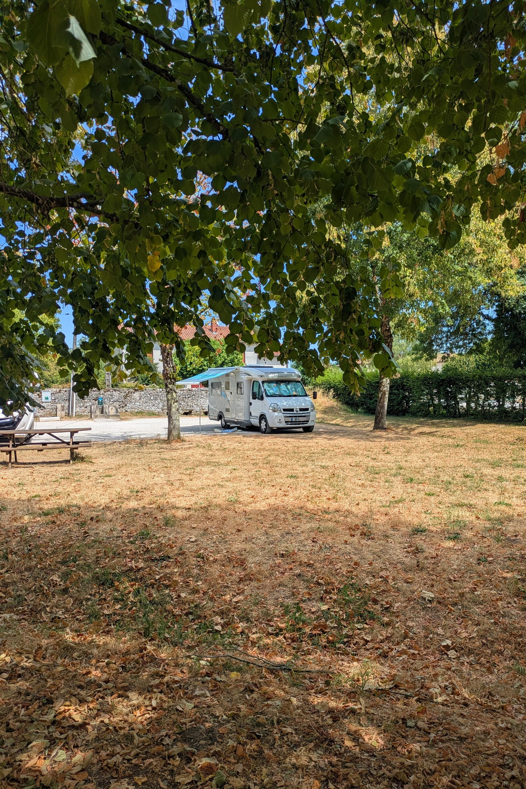
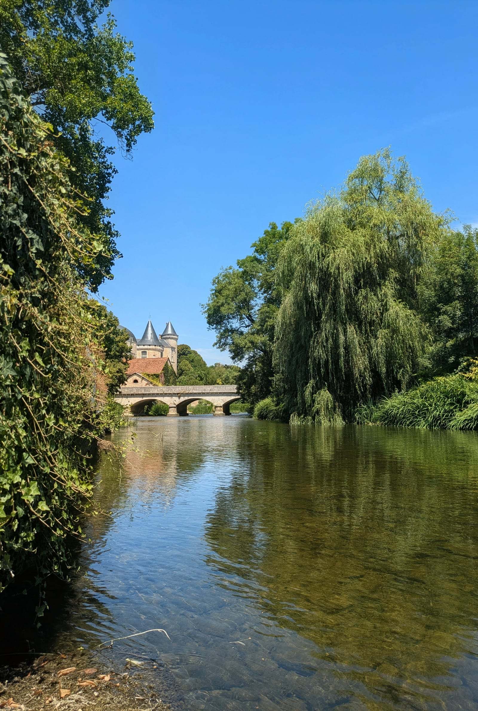
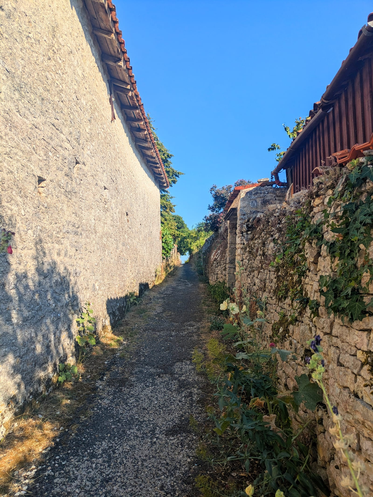

Some villages announce themselves. Verteuil-sur-Charente just lets you arrive, and then, about ten minutes in, does its little spell: the river slows, the castle leans into view above the willows, and you realize you have stopped making plans for the evening because the evening has made them for you.

## Quick verdict

★★★★★ — 5/5 lanterns.

A peaceful free motorhome stop inside a park, right by the river, with free services, paid electricity, a very friendly village, and the rare feeling that staying longer would not be a mistake.

It is small, quiet, practical, and beautiful in the exact way I needed.

## The practical part

There is a free public parking area suitable for motorhomes, inside a park that leads directly to the river. It has space for around six motorhomes comfortably, though it could probably fit eight.

The parking is super flat. I did not need to put leveling blocks under Ember, which always feels like a small miracle. The ground is gravel, so it is also very easy to get the motorhome floor dirty, because apparently every paradise requires a small tax.

There are no height barriers. The streets to get there are tight in the very European way, but Ember is small, so I had no problem getting in or out.

The official maximum stay is 48h. Treat that as the rule.

At night it was extremely quiet. I felt very safe alone.

The pin on the Atlas marks the village, not the exact sleeping spot. Some pins are approximate, especially when they mark places where the camp slept.

## Services

The services are free:

- potable water
- grey water disposal
- black water / toilet cassette disposal
- trash and recycling

There are toilets nearby: one in town and one in the park. I did not check whether showers were available.

Electricity is €5 for 24h. You call the number posted at the aire, and Chavaud comes to connect it for you. I paid in cash, though most places in the village seemed to accept card.

Mobile signal was good enough for working and internet.

## What I liked

The river walk, first and always.

The Charente here is slow and green and completely unbothered, and there is a path that follows it past the castle, under big trees, along gardens that seem to be competing quietly and politely.

The motorhome parking is close enough to the river that the whole stop feels connected to the water. Not "parking near a nice place," but "parking inside the quiet edge of the nice place."

I even got into the river with the cats, which was ridiculous and perfect.

## The village

The village is about 10 minutes away on foot. You cross the park and the river, and suddenly you are there.

It is one of the smallest villages I have stayed in so far, but it has enough to make the stop feel easy:

- a bakery, though I have not managed to catch it open yet because it only opens in the mornings, naturally, like a tiny French test of character
- a newly opened takeaway place
- some restaurants
- a bar where they speak English
- a small shop for basic amenities
- a Thursday pizza food truck
- a place by the river that does crêpes

There is no supermarket in the village. For that, you need to go to Ruffec.

Everyone I met was genuinely friendly in the way that makes a place feel softer almost immediately.

## Things to do

You can book a kayak descent with Base Canoë-Kayak de Ruffec Rejallant for €20.

I am doing this on Sunday, so this section will be updated after I find out whether I survive with dignity.

## Cat and motorhome notes

This was a very good stop with cats.

The village is small, the park is calm, traffic is low, and I walked the cats every day without trouble. There were no obvious dangers, no constant noise, and enough quiet for them to explore without the world shouting at them.

Ember approved of the flatness.

The gravel, however, immediately began trying to move inside with us.

## Emergency kindness: RJ MecaServices

While I was here, three fuses melted from the heat, because apparently Ember has decided to participate in summer by slowly cooking her own tiny organs.

RJ MecaServices is about 20 minutes away on foot. I went there and mimed the fuses blowing, with all the dignity a person can have while performing electrical failure in French.

The mechanic got in his car, came back with me, and fixed it. He was very kind and very helpful. They only speak French, but I would absolutely recommend them.

## Would I return?

Yes. Absolutely.

This is the kind of stop that recalibrates what you think you need from a place. It has almost nothing, which turns out to be almost everything: free services, river access, a safe quiet night, a walkable village, friendly people, and enough beauty to make the stop feel like part of the trip instead of just logistics.

## Small beautiful thing noticed

After 17h, the sun finally slipped behind the trees and the whole parking changed species. What had been gravel, heat, extension cables, and open windows became suddenly softer: a camp again, with the river just beyond the path and the cats moving through the evening like they had always belonged there.
